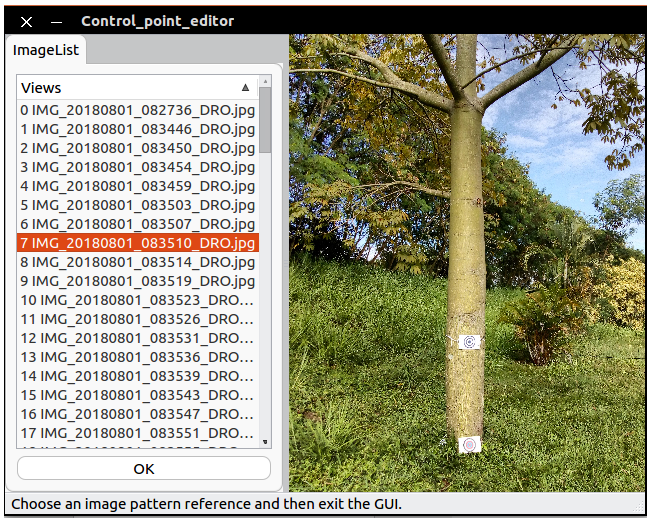

# gui-Control-points
Gui for select image pixel reference for iTree3DMap. This program uses the control point registration GUI of OpenMVG as base.

----------------

## GUI
 

## Dependencies
* OpenMVG
* Cereal
* runit

## Compile
     cmake ../
     make

## Test
    usage: ./control_point_Reg <sfm data bin/xml> <output dir>
